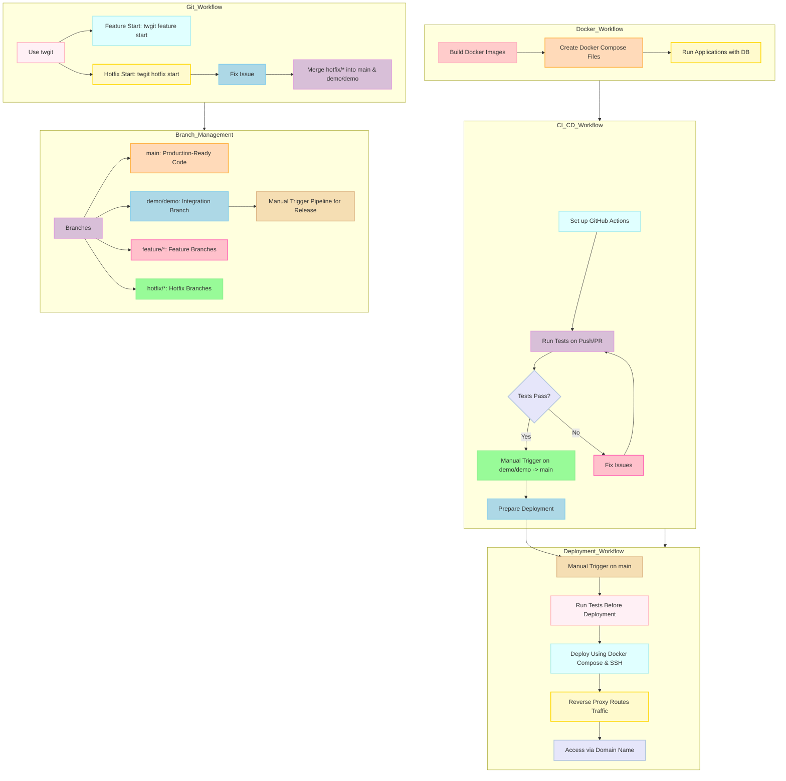

# Structure of the Project (Sacha & Théo) - Mermaid Diagrams

```mermaid
graph TD
    %% Sous-graphes
    subgraph Docker_Workflow
        A[Build Docker Images] --> B[Create Docker Compose Files]
        B --> C[Run Applications with DB]
    end

    subgraph CI_CD_Workflow
        D[Set up GitHub Actions] --> E[Run Tests on Push/PR]
        E --> F{Tests Pass?}
        F -- Yes --> G[Manual Trigger on demo/demo -> main]
        G --> H[Prepare Deployment]
        F -- No --> I[Fix Issues]
        I --> E
    end

    subgraph Deployment_Workflow
        H --> J[Manual Trigger on main]
        J --> K[Run Tests Before Deployment]
        K --> L[Deploy Using Docker Compose & SSH]
        L --> M[Reverse Proxy Routes Traffic]
        M --> N[Access via Domain Name]
    end

    subgraph Branch_Management
        O[Branches]
        O --> P[main: Production-Ready Code]
        O --> Q[demo/demo: Integration Branch]
        O --> R[feature/*: Feature Branches]
        O --> S[hotfix/*: Hotfix Branches]
        Q --> T[Manual Trigger Pipeline for Release]
    end

    subgraph Git_Workflow
        U[Use twgit]
        U --> V[Feature Start: twgit feature start]
        U --> W[Hotfix Start: twgit hotfix start]
        W --> X[Fix Issue]
        X --> Y[Merge hotfix/* into main & demo/demo]
    end

    %% Connections
    Docker_Workflow --> CI_CD_Workflow
    CI_CD_Workflow --> Deployment_Workflow
    Git_Workflow --> Branch_Management

    %% Styles
    style A fill:#FFCCCB,stroke:#FFB6C1,stroke-width:2px
    style B fill:#FFDAB9,stroke:#FFB347,stroke-width:2px
    style C fill:#FFFACD,stroke:#FFD700,stroke-width:2px
    style D fill:#E0FFFF,stroke:#AFEEEE,stroke-width:2px
    style E fill:#D8BFD8,stroke:#DDA0DD,stroke-width:2px
    style F fill:#E6E6FA,stroke:#B0C4DE,stroke-width:2px
    style G fill:#98FB98,stroke:#90EE90,stroke-width:2px
    style H fill:#ADD8E6,stroke:#87CEEB,stroke-width:2px
    style I fill:#FFC0CB,stroke:#FF69B4,stroke-width:2px
    style J fill:#F5DEB3,stroke:#DEB887,stroke-width:2px
    style K fill:#FFF0F5,stroke:#FFB6C1,stroke-width:2px
    style L fill:#E0FFFF,stroke:#AFEEEE,stroke-width:2px
    style M fill:#FFFACD,stroke:#FFD700,stroke-width:2px
    style N fill:#E6E6FA,stroke:#B0C4DE,stroke-width:2px
    style O fill:#D8BFD8,stroke:#DDA0DD,stroke-width:2px
    style P fill:#FFDAB9,stroke:#FFB347,stroke-width:2px
    style Q fill:#ADD8E6,stroke:#87CEEB,stroke-width:2px
    style R fill:#FFC0CB,stroke:#FF69B4,stroke-width:2px
    style S fill:#98FB98,stroke:#90EE90,stroke-width:2px
    style T fill:#F5DEB3,stroke:#DEB887,stroke-width:2px
    style U fill:#FFF0F5,stroke:#FFB6C1,stroke-width:2px
    style V fill:#E0FFFF,stroke:#AFEEEE,stroke-width:2px
    style W fill:#FFFACD,stroke:#FFD700,stroke-width:2px
    style X fill:#ADD8E6,stroke:#87CEEB,stroke-width:2px
    style Y fill:#D8BFD8,stroke:#DDA0DD,stroke-width:2px
```
